# Lab 01 Report - Introduction to Open Source Software

## Reading Assignments

### How to Answer Questions in a Helpful Way

1. Respond with the appropriate level of technical detail - you want to provide enough information to make your response useful to the question asker, but not so much extraneous information that it becomes difficult for someone with less experience to understand
2. If someone is asking for technical advice on how to do something one way which may be easier to accomplish another way (such as something low level in a high level language where it is _technically_ possible, but will require jumping through additional hoops), make sure that they understand that there may be other options. However, remember that they may have a valid reason to be doing things the way that they are.

### Free Culture

​	Jesse Jordan's only crime was providing an tool for students to organize public data - yet the music industry was so threatened by this that they served him a 15 million dollar lawsuit. Music (proprietary code) is only valuable so long as it can't be found freely available online. In the case of Jesse, the music industry went to such great lengths to prevent others from making their copyright freely available online that they were willing incur collateral damage in the form of tech savvy students. They understood that Jesse had done nothing "wrong" or "evil", and that they would be likely loose the case if Jesse fought it in court, but due to the power imbalance of a helpless college student taking on a multi billion dollar business they knew that they could get away with it. While we may not be going into the music industry, the software industry is still filled with patent trolls and those who seek profit at the cost of the public good. However, UNLIKE Jesse, we have the ability to fight back against the Apples and Googles of the world by making our software open source, so that they cannot patent our ideas or persecute others for them.

## Linux

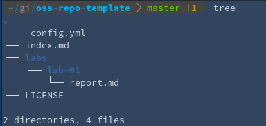

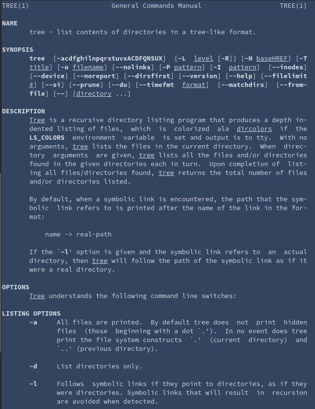

## Regex

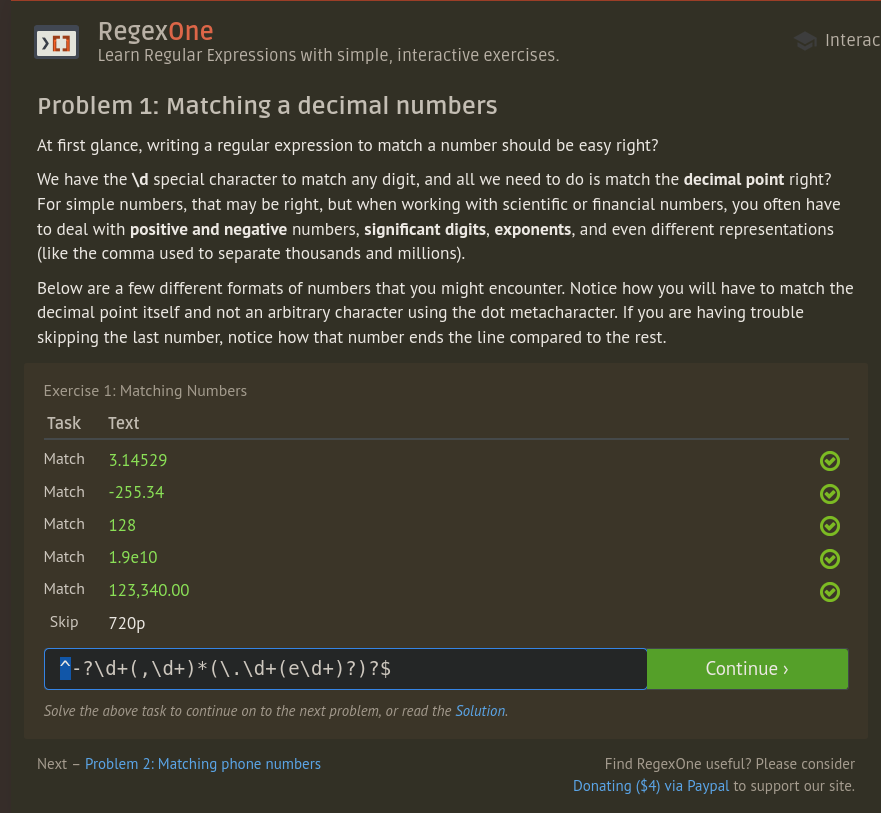

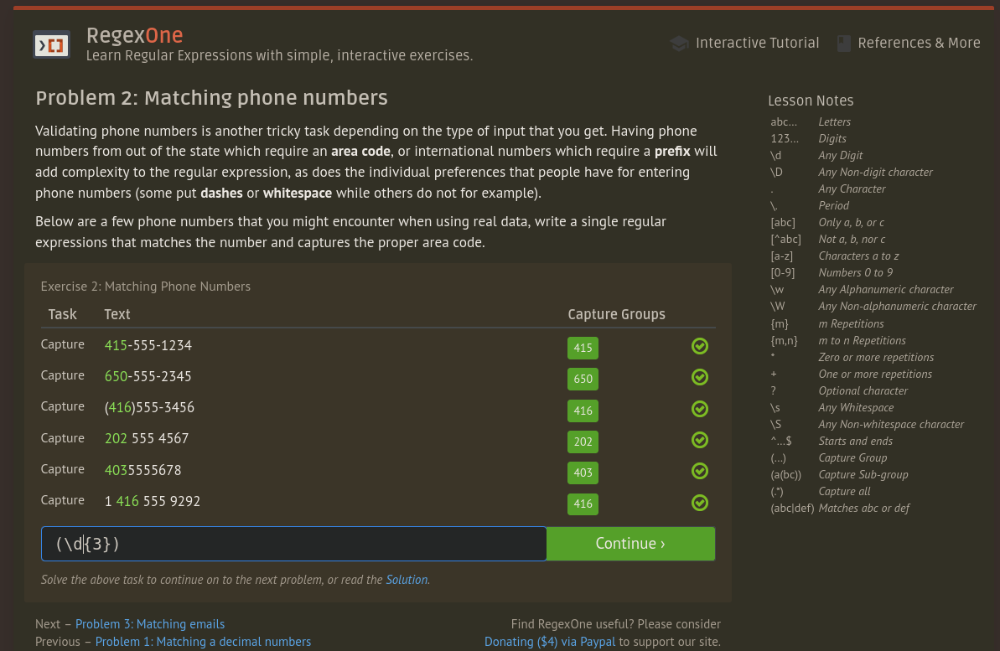

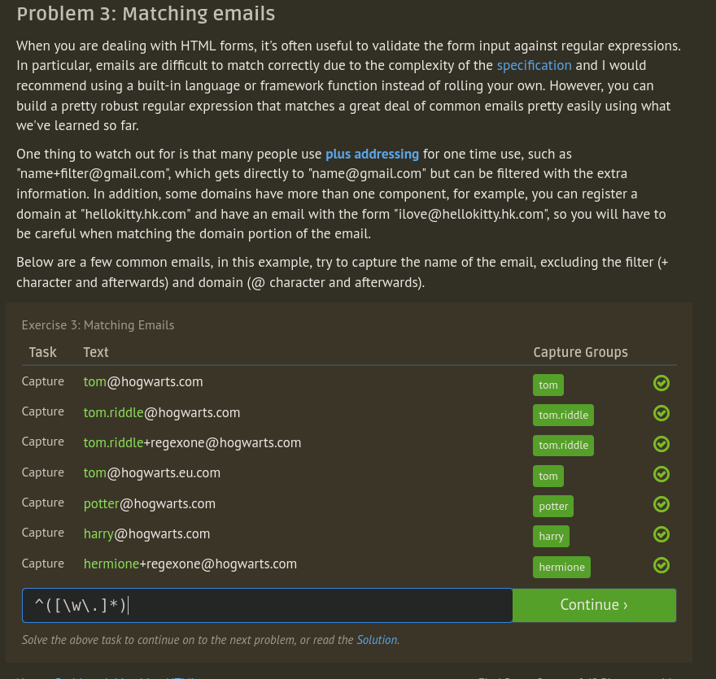

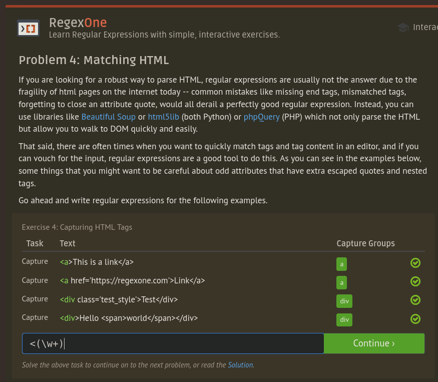

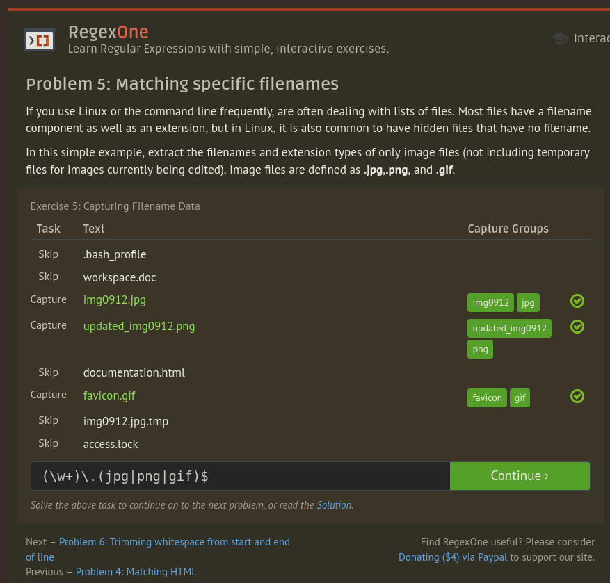

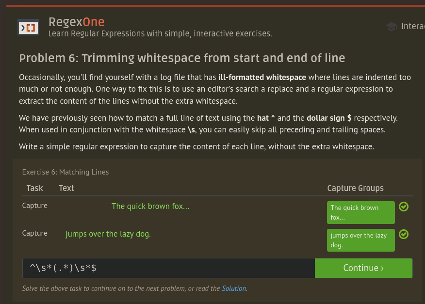

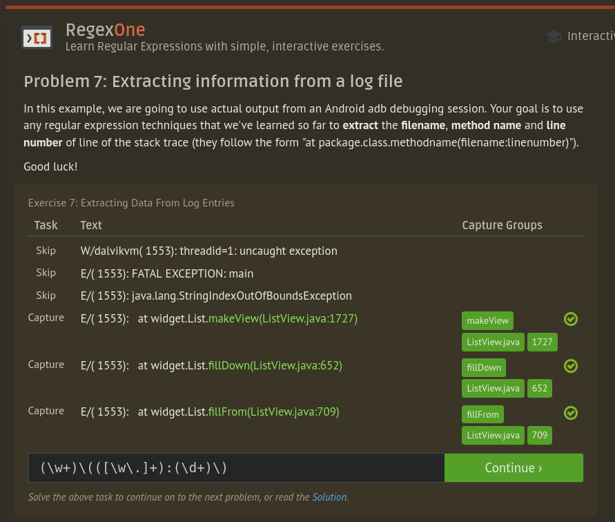

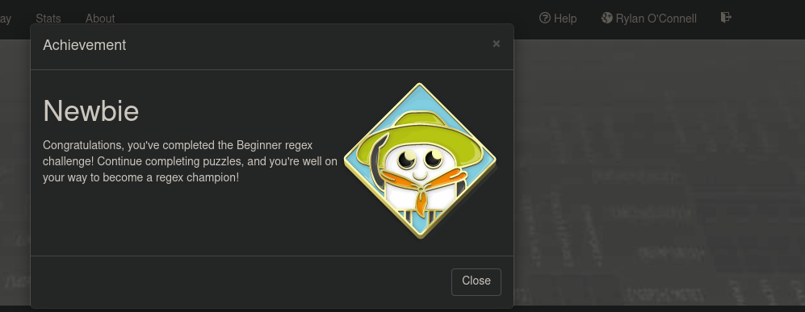

## Play with Snap or Blockly

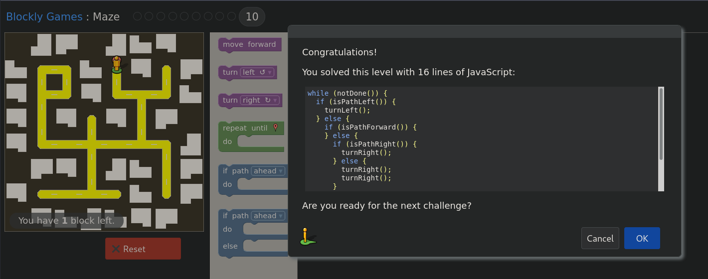

## Reflection

​	Fuzzing is an important, yet often overlooked part of the software testing processes. By "fuzzing" a piece of software, a tester can automatically generate new test cases and see how the software handles each input. Unlike traditional unit testing, the goal of fuzzing is not to verify that the correct output is generated for each input, but rather to ensure that a program can handle each input without crashing or hanging. While this is obviously useful for guaranteeing the _usability_ of a piece of software, many of the real advantages of fuzzing are related to security. Often times, the same bugs which can be used to exploit a program can also manifest themselves through behavior like segmentation faults. Unfortunately, much of the research in this field is run by either security researchers who want to minimize the chance of other researchers coming up with the same findings and reporting them first, or by companies who have formed their businesses around providing fuzzing as a service to companies in industries (such as the financial industry) which are required to fuzz their software for bugs by regulations. As such, much of the cutting edge research is proprietary and merely speculation to the average user. However, [Brandon Falk](https://github.com/gamozolabs) has recently been developing an open source and extremely high performance fuzzing platform so that normal developers can understand the process of fuzzing, and can experience from the same usability and security benefits as the professionals. This project is complex enough that Brandon has separated it into several sub-projects, but I specifically would be interested in evaluating and better understanding his [fzero_fuzzer](https://github.com/gamozolabs/fzero_fuzzer), and [chocolate_milk](https://github.com/gamozolabs/chocolate_milk) (responsible for loading and running a binary).

