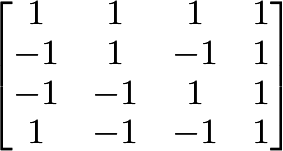

## Documentation

1. [Wiki Link](https://github.com/RylanOC/oss-repo-template/wiki/Project-Ideas)

2. LaTeX Formulas

   

1. Hadamard Matrix

## Community

### Projects

Since we opted to split the workload up into one project per group member, we decided that it would be easiest to use a shared Google doc to track all of them. This shared document can be found [here](https://docs.google.com/document/d/1ba5yExqEPxpVeJ9VadcYCiYgZS4C0YgzuyApd5GrQSo/edit?usp=sharing)

### Gitstats Comparison

While many of these stats aren't easily accessed via gitstats (eg. while gitstats shows the year of the first commit, it doesn't give us much information about _what_ that commit was), neither the number of contributers nor the number of lines of code line up with the GitHub UI. While GitHub seems to filter some users out in the contributers list (eg. dependabot, duplicate names for the same contributer, etc.), `gitstats` fails to do so. Similarly, the number of lines of code produced by the method from the handout is signifigantly shorter than the number generated by `gitstats`. While it's unclear exactly where this difference comes from, it may be ignoring dotfiles or hidden directories.