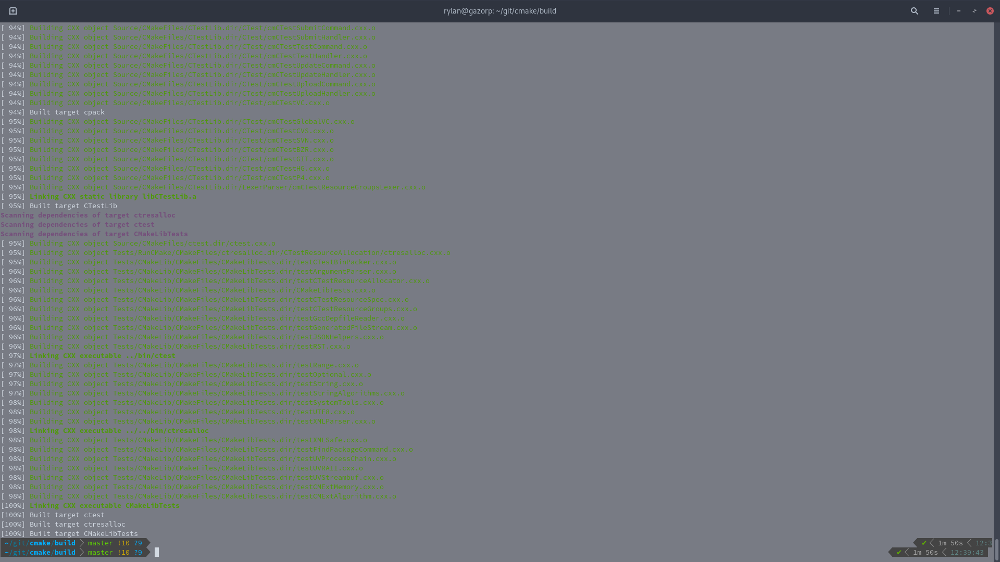
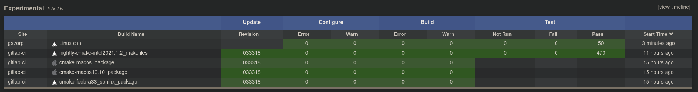
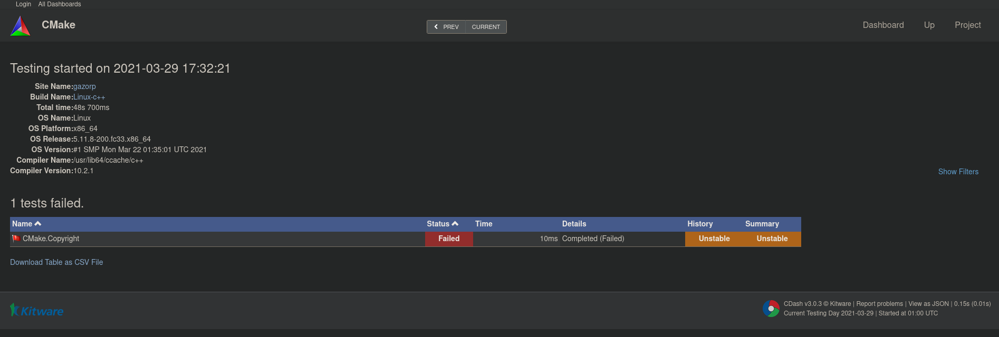
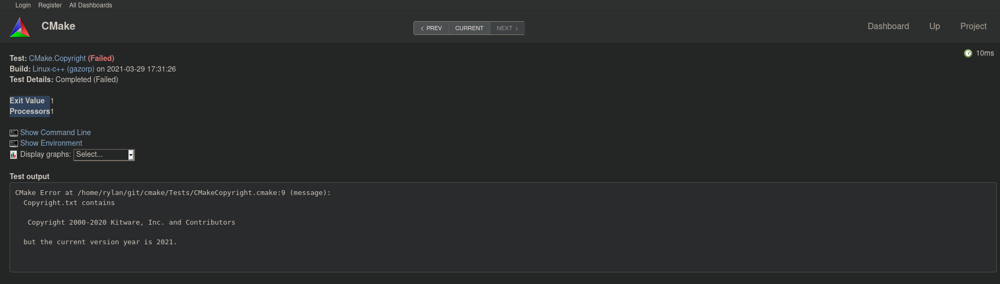
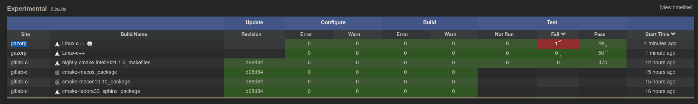
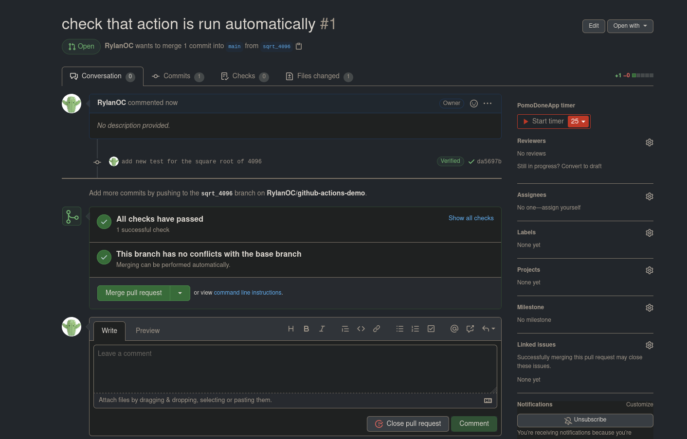
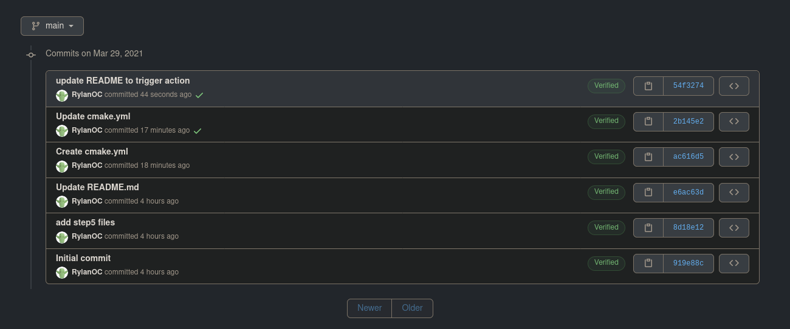

# Lab 8

## CMake Testing

### Checkpoint 1

Successful build:

### Checkpoint 2

After building the clean CMake code, we can see that all tests pass just fine:

### Checkpoint 3

After modifying the copyright file, we can see that we fail the corresponding `Cmake.Copyright` test:

Looking closer, we can see exactly where this error comes from:

By updating the year from "2020" to "2021" as suggested, we can see that we pass the test again (note the timestamps of the failed vs passed tests):

### Checkpoint 4

[Repository link](https://github.com/RylanOC/github-actions-demo)

This action gets triggered on pull requests:

And pushes:

### Checkpoint 5

Since there was no `#Projects` channel in the Discord (and it looks like nobody else was posting in any of the other channels), my group opted to document our project here instead:

| Project Name     | Buoy                                         |
| ---------------- | -------------------------------------------- |
| Observatory Link | https://rcos.io/projects/cmlino/buoy/profile |
| Blog Link        | https://rcos.io/projects/cmlino/buoy/blog    |
| GitHub Link      | https://github.com/cmlino/buoy               |
| Collaborators    | Christina Lino, Rylan O'Connell              |