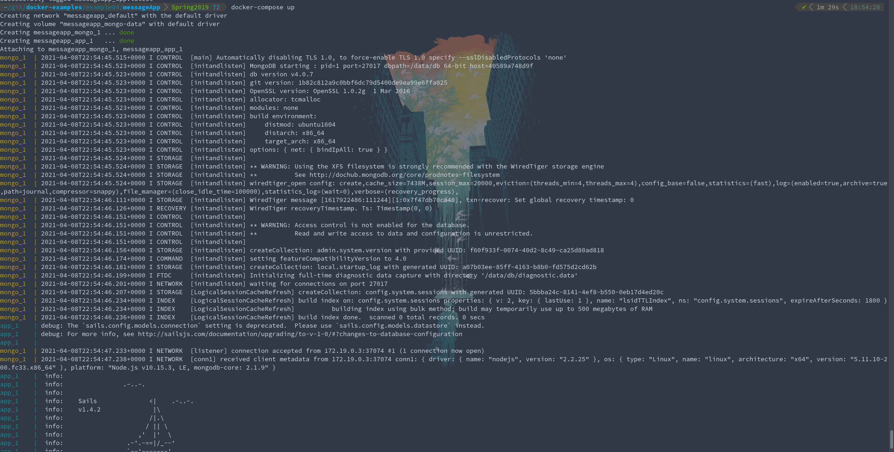

### Example 0

### Example 1

### Example 2

### Example 3

### Example 4

### Ovservations
Overall, this lab was fairly straightforward for me. Since I am on a native linux installation, I didn't have to worry about any issues relating to WSL, and I was able to follow the directions from the `docker-examples` repo without any issues. Since most of the commands were provided (along with the `Dockerfile`s and `docker-compose.yml` for the for the fourth stage), this lab went fairly quickly.
